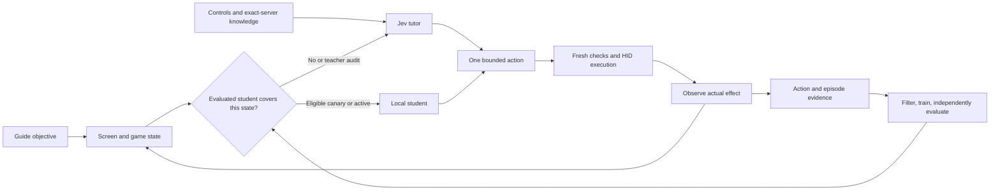

# Jev teaches through playing

This is the current implementation contract. It supersedes the original assumption that
the teacher only selects whole skills or writes suggestions after failure.

The guide chooses the objective. Jev receives an owned screenshot, the radio decoded
from those same pixels, configured controls and their meanings, the current guide goal,
retrieved exact-server facts, and recent action outcomes. It proposes one bounded action.
The executor checks fresh state and sends input; an independent observer checks the
predicted effect. Completed useful episodes supply training evidence. Evaluated local
capabilities gradually take over, with Jev retaining unfamiliar situations and audits.



## What is built

| Component | Behavior |
|---|---|
| `jev/play/actions.py`, `controls.py` | Typed movement, turning, strafe, target selection, action slots, pointer, grounded clicks, camera and existing skills. Account/character binding overrides retain source hashes and uncertainty. |
| `teacher.py` | Actual embedded PNG input through the existing Claude subscription CLI, typed output, observation identity, bounded knowledge lookups, per-attempt accounting, cancellation and subprocess cleanup. |
| `knowledge.py`, `world_knowledge.py` | Guide, objectives, starting abilities, vendors and bounded read-only entity retrieval from the existing world/DBC snapshot. Content fingerprints invalidate incompatible students. |
| `executor.py` | One input owner, short bounded holds, fresh hover before unit clicks, painted UI control coordinates, focus/state checks and unconditional release. Right-click never establishes facing by assertion. |
| `observation.py` | Same-capture pixels/radio, shared coordinate conversion, fresh paint evidence, independent observed effects. Movement alone is never credited as closing distance. |
| `controller.py`, `runtime.py` | Teacher/student action loop inside the normal supervisor and guide. Existing routines remain callable under their current validation. Repeated ineffective decisions stop for inspection. |
| `learning.py` | Durable action/episode joins, learned visual-conditioned action parameters, independent evaluation, shadow, canary, active capability, teacher audits and failure rollback. |
| `journal.py` | Flushed requests, accepted decisions, results, observations and completed episodes. Crash tails never acquire invented outcomes. |

There is no generated-code execution or automatic editing of Fight, navigation constants,
the guide or the input executor. A learned action remains within the same typed contract
and must pass the same fresh execution checks as a teacher action.

## Supervised test

The prepared machine-specific configuration is `var/teaching-launch.json` (ignored by
Git). It names the native Windows interpreter, authenticated teacher executable, saved
account/character binding files, native learning store and the existing saved playhead.
The initial configuration is a 180-second teacher-led test with one-second screenshots,
one retry, a stop file and no-progress stop. It does not start the client merely by being
created or checked.

From the checkout with Windows Python:

```text
C:\forever-win\Scripts\python.exe tools\start_teaching.py
```

This default only runs the offline graph/capability check. The explicit live entrypoint,
after the screenshot export permission and supervised-test go-ahead are settled, is:

```text
C:\forever-win\Scripts\python.exe tools\start_teaching.py --run
```

The stop file is `captures/teaching/STOP`. Its existence stops before attachment or at
the supervisor's next checkpoint. It is never silently deleted. Ctrl-C and shutdown use
the existing release/cleanup path. Teacher unavailability or a teaching stall stops the
session; no automatic restart repeats a broken interaction.

Direct portable entrypoint:

```text
python tools/probe_slice.py --play-mode teach --route-mode supported --run-for 180 --retries 1 --reconnect --no-progress 120 --stop-file captures/teaching/STOP --bindings ACCOUNT_BINDINGS --bindings CHARACTER_BINDINGS
```

`--play-mode teach` and `adaptive` both enable screenshots and continuous learning.
`teach` always gives Jev control while comparing students in shadow. `adaptive` permits
only evidence-qualified student canaries and active capabilities. `--teacher` remains the
older strategic suggestion mode when playing mode is off; it does not start a second
strategic model queue alongside the visual tutor.

The motor tutor has its own persistent call budget, default 240 attempts/hour, and a
30-second decision deadline. Every lookup/model attempt consumes budget, including
timeouts. These are operational limits, not measured game timing. They can be set with
`--play-teacher-calls-per-hour` and `--play-decision-timeout`. No key remains held while
waiting for the model. Actual served model and token counts are recorded separately
from the requested `sonnet` alias.

## Continued collection and handover

After the initial live test has established useful play, the same launcher can collect
successive clean sessions while keeping the playhead and learning store:

```text
C:\forever-win\Scripts\python.exe tools\start_teaching.py --run --mode adaptive --sessions 0 --session-seconds 3600
```

Zero sessions means repeat until operator stop, failure or completion of the supported
quest route. Each session fully closes its recorder, worker, capture and input lease
before the next begins. Failures never auto-restart. Separate real recordings satisfy
independent evaluation groups; one continuous recorder is not relabelled into fake runs.
The worker trains during collection and recovers persisted evidence after restart.

Handover requires enough successful episodes in independent training, held-out, shadow
and canary runs. One evening may produce useful data without any promoted student.
Teacher use falls only for capabilities that demonstrate useful outcomes and lower
teacher cost; fresh context and failures hand decisions back to Jev. See
[the exact learning gates](MOTOR_LEARNING.md).

## Evidence and limits

Every run keeps the existing strategic/execution streams plus `play-config.json`,
`play-observations.jsonl`, `play-actions.jsonl`, `play-episodes.jsonl` and
`play-teacher.jsonl`. Accepted input and its independently judged outcome are separate.
Teacher request, fresh pre-input and final frames remain distinct. Polling during an
outcome window does not save a full extra PNG every tenth of a second; the chosen final
owned frame and the continuous one-second record are retained.

Composed service outcomes are judged across their whole observed interval: stable supply
identity and a count gain verify replenishment even after a shop has closed or junk sales
offset spending. A bounded loot attempt returning `nothing` remains non-fatal, with no
invented take, empty-corpse assertion or positive learning reward. An unknown resource
type cannot mark rest complete. Modal dismissal uses the same input worker, including
during combat, while death, guide failure and normal combat preemption retain priority.

The native store's `motor/` directory contains atomic records, episode outcomes,
versioned model data, registry and `latest-cycle.json`. Failed, unknown and interrupted
attempts remain reviewable. Synthetic fixtures cannot promote a production student.

The initial student uses a small visual descriptor and conservative novelty checks. It
does not have general game understanding or trained live competence at installation.
Configured bindings and generated starting-slot identities are not a live keybind/bar
readback. The current radio has no auto-attack active bit; repeated uncertain toggles are
suppressed and the limitation is exposed to Jev. Name hashes distinguish names rather
than individual same-name creatures. Exact-server templates cannot prove a live spawn,
present stock, successful click, useful facing, damage or a completed quest.

Software tests establish the wiring and failure handling. They do not establish that
the next live wolf will be approached, attacked and looted. That is the first acceptance
test. Subsequent gates are wolf-meat progress and turn-in, then sustained service and
recovery, then measured capability handover. Current deployment/transport evidence is
documented in [TEACHING_TRANSPORT.md](TEACHING_TRANSPORT.md).
